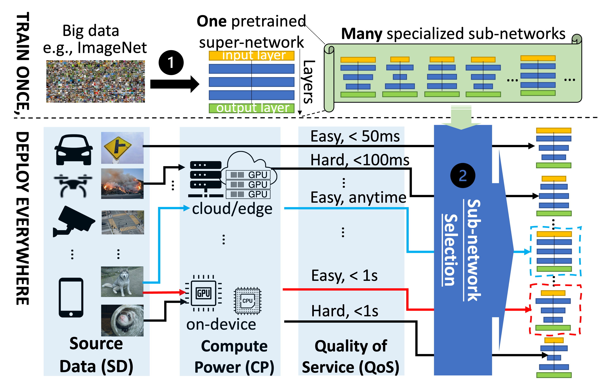

My research aims to build an efficient mobile vision system with edge-assisted live video analytics.
I am interested in exploiting and developing a multi-disciplinary solution that incorporates computer vision, edge computing, multimedia and machine learning to enhance the system's effectiveness and efficiency. 

Currently, I am particular interested in the following problems:
* Making mobile vision more efficient with more video compression
* Enhancing DNN deployment efficiency in diverse use scenarios

Making Mobile Vision More Efficient with More Video Compression
----
Given the fast development in computer vision, we orthogonally enforces more efficient compression for the specific vision inference tasks. Our approach  adapts to input contexts and significantly reduces the volume of video data without sacrificing visual inference accuracy.
<!--Compress Video without Compromising Analytical Accuracy-->

#### VPPlus: Exploring the Potentials of Video Processing for Live Video Analytics at the Edge

    <video width="320" height="240" controls style="float: left; margin-right: 10px;">
        <source src="../images/vpplus.mp4" type="video/mp4">
        Your browser does not support the video tag.
    </video>
    
VPPlus aims to compress video content live streamed from the device to the edge without scarifying accuracy and timeliness of its video analytics. It enlarges the configuration space that can be optimized during on-device processing to achieve greater compression and generates proper feedback automatically to guide the joint tuning over more than 8 parameters (e.g. brightness, saturation, etc.).

Enhancing DNN Deployment Efficiency in Diverse Use Scenarios
----
For efficient deployment, a DNN is specialized by training to fit the target use scenario (depending on computing power and visual data input). To handle this costly training and meet diverse deployment needs, we tailor the DNN to enhance performance for each scenario using Once-For-All DNN paradigm. This involves training one super network and searching for different sub-networks (subnets) to fit the specific use case.
<!--Customize DNN Deployment in Diverse Use Scenario-->

#### OPA:One-Predict-All For Efficient Deployment

    
    
Instead of training a specialized DNN for each deployment scenario, we have developed a
novel approach of using one shallow subnet to test the water. The effectiveness of using a
shallow subnet to accelerate the search of a deep subnet has been validated effective in image
classification, one showcase application.

